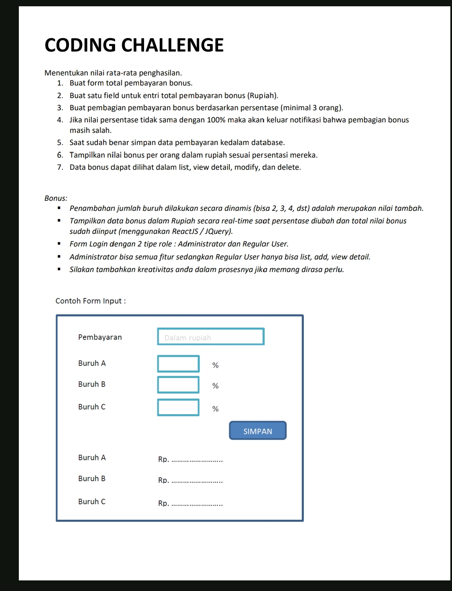

# TES SKILL CODING LOKER PT Arca Internasional

## SOAL:



## PENJELASAN:

1. Gunakan laragon atau software web server yang lain, saya menggunakan php versi 8.1.10
1. Menggunakan codeigniter 3 karena ingin cepat walau codeigniter 3 sudah ketinggalan jaman.
1. Ketika mengakses aplikasi pastikan terkoneksi internet, karena semua dependensi berupa cdn
1. tombol register hanya dapat digunakan jika data pada tabel users kosong atau kurang dari 2 data
1. Username dan Password untuk login:

```
role Admin:
	username: admin
	password: admin
role User:
	usernema: user
	password: user
```

## HASIL:

<p>Dibuat dengan Codeigniter 3, Bootstrap 5, Font Awesome 6, Sweetalert2, Datatables,dll</p>

<h3>Dibuat dalam waktu 4 Jam</h3>

<hr>


<p>Tombol register dapat digunakan jika tabel user kosong</p>
<hr>
<hr>
<hr>
<hr>
<hr>
<h4>List Bonus Role User:</h4>
<hr>
<hr>

> [!NOTE]
> Copyright$copy;2024 <a href="https://www.instagram.com/99ir.ib/">Irsyad Project</a>.
