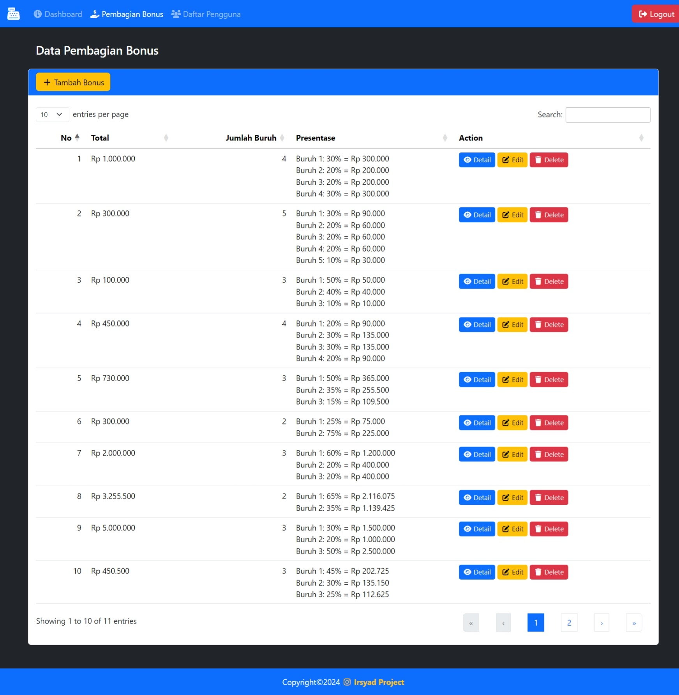

# TES SKILL CODING LOKER PT Arca Internasional

## SOAL:


## CARA MENGGUNAKAN:

1. Gunakan laragon atau software web server yang lain, saya menggunakan php versi 8.1.10
1. Username dan Password untuk login:

```
role Admin:
	username: admin
	password: admin
role User:
	usernema: user
	password: user
```

## HASIL:

<p>Dibuat dengan Codeigniter 3, Bootstrap 5, Font Awesome 6, Sweetalert2, Datatables,dll</p>

<h3>Dibuat dalam waktu 4 Jam</h3>

<hr>


<p>Tombol register dapat digunakan jika tabel user kosong</p>
<hr>
<hr>
<hr>
<hr>

> [!NOTE]
> Copyright <a href="https://www.instagram.com/99ir.ib/">Irsyad Project&copy; 2024</a>.
